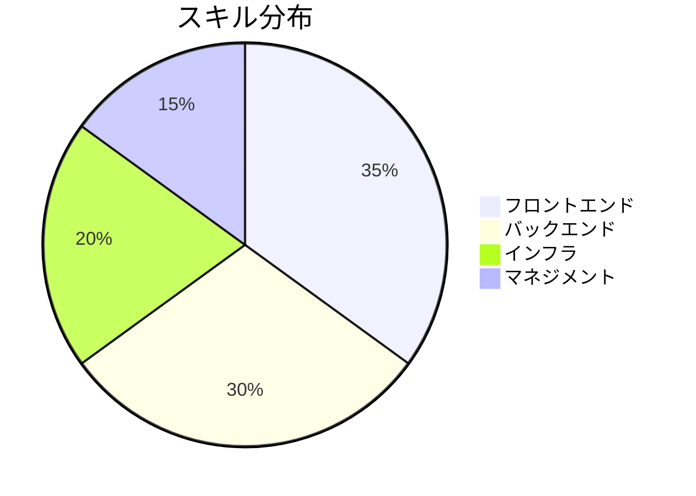

# 山田 太郎

シニアソフトウェアエンジニア

<div class="pt-12">
  <span class="px-2 py-1 rounded text-sm opacity-80">
    10年以上のソフトウェア開発経験
  </span>
</div>

<div class="abs-br m-6 flex gap-2 text-sm opacity-50">
  <div>📧 taro.yamada@example.com</div>
  <div>📍 東京都渋谷区</div>
</div>

---
layout: two-cols
layoutClass: gap-16
---

# 職務要約

<v-clicks>

- **10年以上**のソフトウェア開発経験
- フルスタックエンジニアとして活躍
- **TypeScript/React/Node.js**を用いたモダンWeb開発
- **AWS/GCP**を活用したスケーラブルなシステム設計
- チームリーダーシップの経験

</v-clicks>

::right::

<div class="mt-10">

## 強み



</div>

---
layout: section
---

# 職務経歴

---

# 株式会社テックイノベーション

<div class="text-sm opacity-70 mb-4">2021年4月 - 現在 | シニアソフトウェアエンジニア / テックリード</div>

大規模ECプラットフォームの開発・運用を担当

<v-clicks>

### 主な実績

- 🚀 システムのパフォーマンスを**40%改善**
- ⚡ CI/CDパイプラインを構築し、デプロイ時間を**75%短縮**
- 👥 新規エンジニアのオンボーディングプログラムを設計・実施
- 🏗️ **10名**のエンジニアチームをリード

</v-clicks>

<div class="mt-6">

```ts
// 技術スタック
const stack = ['TypeScript', 'React', 'Node.js', 'PostgreSQL', 'AWS', 'Docker', 'Kubernetes']
```

</div>

---

# グローバルソフト株式会社

<div class="text-sm opacity-70 mb-4">2017年4月 - 2021年3月 | ソフトウェアエンジニア</div>

BtoB SaaSプロダクトの開発に従事

<v-clicks>

### 主な実績

- 🔐 ユーザー認証基盤のリアーキテクチャを実施
- ⚡ APIレスポンス時間を**60%改善**
- ✅ ユニットテストカバレッジを**30%から85%**に向上

</v-clicks>

<div class="mt-6">

```python
# 技術スタック
stack = ['JavaScript', 'Vue.js', 'Python', 'Django', 'MySQL', 'GCP']
```

</div>

---

# スタートアップ株式会社

<div class="text-sm opacity-70 mb-4">2015年4月 - 2017年3月 | ジュニアエンジニア</div>

モバイルアプリのバックエンド開発を担当

<v-clicks>

### 主な実績

- 📱 プッシュ通知システムを設計・実装
- 🗃️ データベース設計の改善によりクエリ速度を改善

</v-clicks>

<div class="mt-6">

```ruby
# 技術スタック
stack = %w[Ruby Rails PostgreSQL Redis Heroku]
```

</div>

---
layout: two-cols
layoutClass: gap-8
---

# 技術スキル

## プログラミング言語

<div class="flex flex-wrap gap-2 mt-2">
  <span class="px-3 py-1 bg-blue-500 text-white rounded-full text-sm">TypeScript</span>
  <span class="px-3 py-1 bg-blue-500 text-white rounded-full text-sm">JavaScript</span>
  <span class="px-3 py-1 bg-blue-500 text-white rounded-full text-sm">Python</span>
  <span class="px-3 py-1 bg-blue-500 text-white rounded-full text-sm">Go</span>
  <span class="px-3 py-1 bg-blue-500 text-white rounded-full text-sm">Ruby</span>
</div>

## フロントエンド

<div class="flex flex-wrap gap-2 mt-2">
  <span class="px-3 py-1 bg-green-500 text-white rounded-full text-sm">React</span>
  <span class="px-3 py-1 bg-green-500 text-white rounded-full text-sm">Vue.js</span>
  <span class="px-3 py-1 bg-green-500 text-white rounded-full text-sm">Next.js</span>
  <span class="px-3 py-1 bg-green-500 text-white rounded-full text-sm">Tailwind CSS</span>
</div>

## バックエンド

<div class="flex flex-wrap gap-2 mt-2">
  <span class="px-3 py-1 bg-purple-500 text-white rounded-full text-sm">Node.js</span>
  <span class="px-3 py-1 bg-purple-500 text-white rounded-full text-sm">Express</span>
  <span class="px-3 py-1 bg-purple-500 text-white rounded-full text-sm">Django</span>
  <span class="px-3 py-1 bg-purple-500 text-white rounded-full text-sm">Rails</span>
</div>

::right::

<div class="mt-10">

## データベース

<div class="flex flex-wrap gap-2 mt-2">
  <span class="px-3 py-1 bg-orange-500 text-white rounded-full text-sm">PostgreSQL</span>
  <span class="px-3 py-1 bg-orange-500 text-white rounded-full text-sm">MySQL</span>
  <span class="px-3 py-1 bg-orange-500 text-white rounded-full text-sm">MongoDB</span>
  <span class="px-3 py-1 bg-orange-500 text-white rounded-full text-sm">Redis</span>
</div>

## クラウド・インフラ

<div class="flex flex-wrap gap-2 mt-2">
  <span class="px-3 py-1 bg-red-500 text-white rounded-full text-sm">AWS</span>
  <span class="px-3 py-1 bg-red-500 text-white rounded-full text-sm">GCP</span>
  <span class="px-3 py-1 bg-red-500 text-white rounded-full text-sm">Docker</span>
  <span class="px-3 py-1 bg-red-500 text-white rounded-full text-sm">Kubernetes</span>
  <span class="px-3 py-1 bg-red-500 text-white rounded-full text-sm">Terraform</span>
</div>

## その他

<div class="flex flex-wrap gap-2 mt-2">
  <span class="px-3 py-1 bg-gray-600 text-white rounded-full text-sm">Git</span>
  <span class="px-3 py-1 bg-gray-600 text-white rounded-full text-sm">CI/CD</span>
  <span class="px-3 py-1 bg-gray-600 text-white rounded-full text-sm">Agile/Scrum</span>
  <span class="px-3 py-1 bg-gray-600 text-white rounded-full text-sm">TDD</span>
</div>

</div>

---
layout: two-cols
layoutClass: gap-16
---

# 学歴

<div class="space-y-6">

<div>
  <div class="text-lg font-bold text-blue-600">東京工業大学</div>
  <div>情報工学修士</div>
  <div class="text-sm opacity-60">2013年4月 - 2015年3月</div>
</div>

<div>
  <div class="text-lg font-bold text-blue-600">東京工業大学</div>
  <div>情報工学学士</div>
  <div class="text-sm opacity-60">2009年4月 - 2013年3月</div>
</div>

</div>

::right::

# 資格・認定

<div class="space-y-4 mt-4">

<div class="flex justify-between items-center border-l-4 border-blue-500 pl-4">
  <span>AWS Solutions Architect - Professional</span>
  <span class="text-sm opacity-60">2023</span>
</div>

<div class="flex justify-between items-center border-l-4 border-blue-500 pl-4">
  <span>Google Cloud Professional Cloud Architect</span>
  <span class="text-sm opacity-60">2022</span>
</div>

<div class="flex justify-between items-center border-l-4 border-blue-500 pl-4">
  <span>応用情報技術者試験</span>
  <span class="text-sm opacity-60">2016</span>
</div>

</div>

---
layout: center
class: text-center
---

# ありがとうございました

<div class="text-2xl mt-8 opacity-80">
  ご質問がございましたらお気軽にどうぞ
</div>

<div class="mt-12 flex justify-center gap-8 text-lg">
  <div>📧 taro.yamada@example.com</div>
  <div>🐙 github.com/taroyamada</div>
</div>

<div class="abs-bl m-6 text-sm opacity-50">
  Powered by Slidev
</div>

